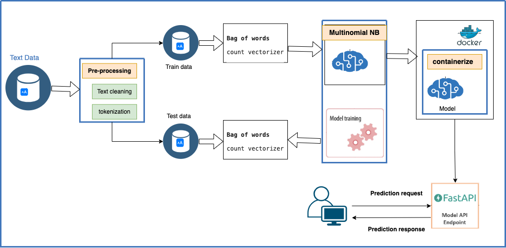

# Language Detection

# Projet Overview

Implementation of a machine learning model for text classification. The model takes text as input and predicts the language of the text. With FastApi an API is created to use the model. The model predicts 17 languages.

## Project architecture



## How to run the project

```bash
docker build -t app-name .

docker run -p 80:80 app-name
```

Go to [http://0.0.0.0/docs](http://0.0.0.0/docs)
